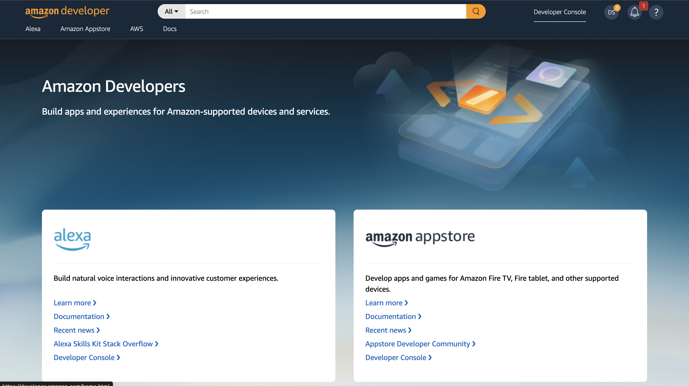
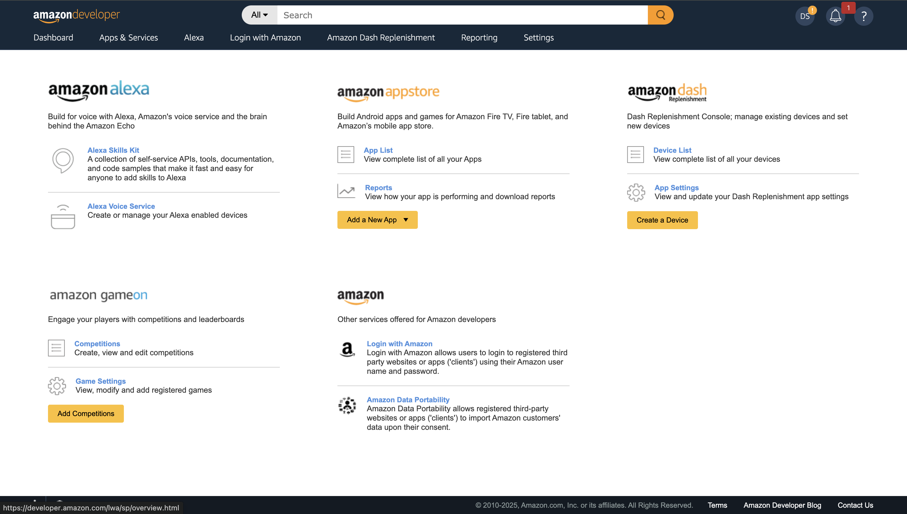
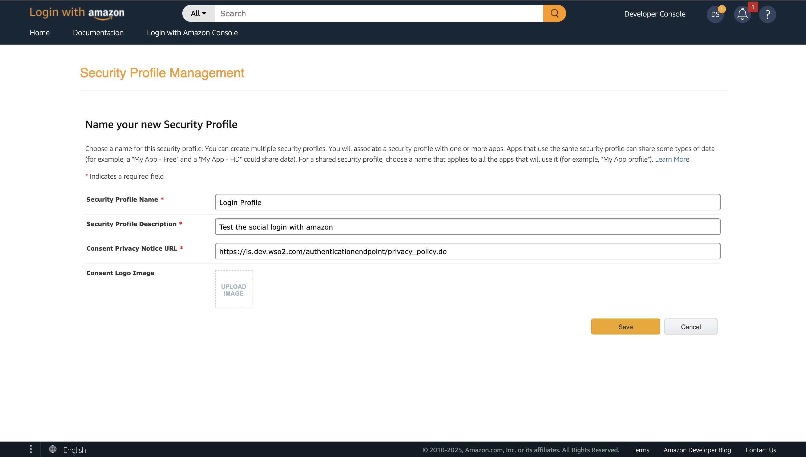
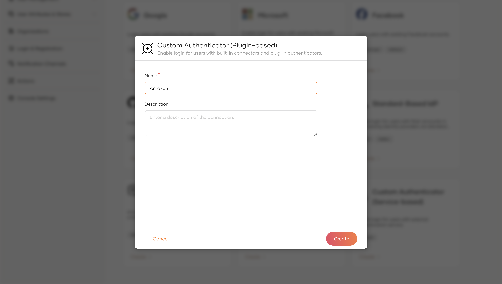
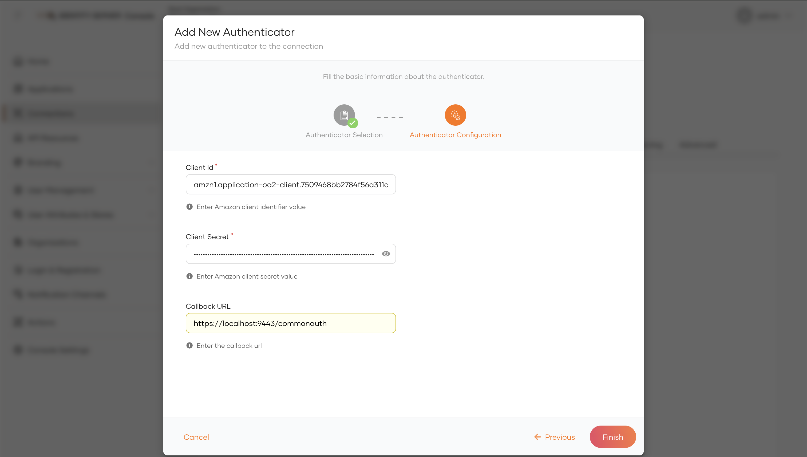
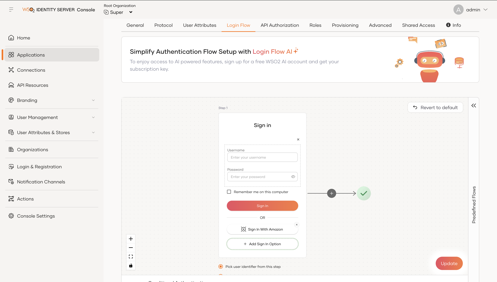

# Amazon Authenticator

The Amazon Authenticator allows seamless integration of Amazon sign in with WSO2 Identity Server, enabling secure authentication and user management. It supports OAuth 2.0 and OpenID Connect protocols, providing a robust solution for federated authentication.

Let's explore the following topics to learn how to configure the Amazon authenticator and WSO2 Identity Server.

* [Deploying Amazon Authenticator artifacts](#deploying-amazon-authenticator-artifacts)

* [Configuring the Amazon Security Profile](#configuring-the-amazon-security-profile)

* [Configuring the identity provider](#configuring-the-identity-provider)

* [Configuring the service provider](#Configuring-the-Service-Provider)

* [Try out the login flow with Amazon account](#try-out-the-login-flow-with-amazon-account)
  ``

## Deploying Amazon Authenticator artifacts
You can either download the Amazon authenticator artifacts or build the authenticator from the source code.

1. To download the Amazon artifacts:
   1. Stop WSO2 Identity Server if it is already running.
   2. Visit the [Connector Store](https://store.wso2.com/connector/identity-outbound-auth-amazon) and download the artifacts.
   3. Copy the `org.wso2.carbon.extension.identity.authenticator.amazon.connector-x.x.x.jar` file into the `<IS-Home>/repository/components/dropins` directory.

2. To build from the source code:
   1. Stop WSO2 Identity Server if it is already running.
   2. To build the authenticator, navigate to the `identity-outbound-auth-amazon` directory and execute the following command in a command prompt.
      ```
      mvn clean install
      ```
      Note that the `org.wso2.carbon.extension.identity.authenticator.amazon.connector-x.x.x.jar` file is created in the `identity-outbound-auth-amazon/component/target` directory.
   3. Copy the `org.wso2.carbon.extension.identity.authenticator.amazon.connector-x.x.x.jar` file into the `<IS-Home>/repository/components/dropins` directory.

## Configuring the Amazon Security Profile

Follow the steps below to configure the amazon security profile for login.

1. Sign in to the [Amazon Developer Console](https://developer.amazon.com/).
2. From the landing page, click **Developer Console**.  
  
3. In the dashboard, select **Login with Amazon**.  
  
4. Create a new security profile by providing the following details:
  - Name
  - Description
  - Privacy Policy URL
  - Logo  
  
5. After creating the security profile, click **Show Client ID and Client Secret** to view the credentials. Note down the Client ID and Client Secret as they will be required when configuring the identity provider.
6. Navigate to the **Manage** section of the created profile, select **Web Settings**, and click **Edit**. Add the following details:
  - **Allowed Origins**: `https://<IS_HOST>:<IS_PORT>`
  - **Allowed Return URLs**: `https://<IS_HOST>:<IS_PORT>/t/<TENANT_DOMAIN>/commonauth`
7. Click **Save** to apply the configurations.

## Configuring the identity provider

An identity provider (IdP) is responsible for authenticating users and issuing identification information by using security tokens like SAML 2.0, OpenID Connect, OAuth 2.0 and WS-Trust.

Follow the steps below to configure WSO2 Identity Server as an IdP that uses Amazon for federated authentication.

> **Before you begin**
> 1. [Download](http://wso2.com/products/identity-server/) WSO2 Identity Server.
> 2. [Run](https://is.docs.wso2.com/en/latest/deploy/get-started/run-the-product/) WSO2 Identity Server.

1. Access the WSO2 Identity Server [Management Console](https://is.docs.wso2.com/en/latest/deploy/get-started/run-the-product/#access-the-wso2-identity-server-console) as an administrator.
2. Go to **Connections** and select **New Connection**. From the available templates, choose **Custom Authenticator (Plugin-based)**. Enter a name for the connection (e.g., Amazon) and click **Create**.  
   
4. On the connection edit page, navigate to the **Settings** tab. Click **New Authenticator**, select **AmazonAuthenticator**, and then click **Next**.

5. Provide the following details for the fields:

- **Client Id**: Enter the client ID copied from the Amazon developer console.
- **Client Secret**: Enter the client secret copied from the Amazon developer console.
- **Callback URL**: `https://<IS_HOST>:<IS_PORT>/t/<TENANT_DOMAIN>/commonauth`



6. Click **Finish**.

## Configuring the service provider

1. Navigate to the **Applications** section and click **New Application** to create an application of your choice for testing login functionality using OIDC, SAML, or WS-Trust protocols.
2. Open the **Login Flow** tab of the newly created application. Click **Add Sign In Option** and select the **Amazon** connection as the sign-in option for the first step.
   

## Try out the login flow with Amazon account

Once you have completed the configuration of the identity provider and service provider, you can test the login flow using the Amazon user accounts.

1. Navigate to the application you configured in WSO2 Identity Server.
2. Click on the login button or access the login URL of the application.
3. On the WSO2 Identity Server login page, select the **Amazon** sign-in option.
4. You will be redirected to the Amazon login page.
5. Enter the credentials of the Amazon user and click **Sign In**.
6. Upon successful authentication, you will be redirected back to the application with the authenticated session.

> **Note:** If you encounter any issues during the login process, verify the configurations in both Amazon and WSO2 Identity Server to ensure they are correct.
